# Scientific Raster Data Sharing on AWS

## High-Level Architecture

```
┌─────────────┐
│   Users     │
└──────┬──────┘
       │
       ▼
┌─────────────────┐
│  CloudFront CDN │ (Tile caching, HTTPS)
└────────┬────────┘
         │
         ▼
┌─────────────────┐
│      ALB        │ (HTTPS listener, path routing)
└────────┬────────┘
         │
    ┌────┴────┐
    │         │
    ▼         ▼
┌────────┐ ┌──────────┐
│ Tiles  │ │Timeseries│ (ECS Fargate services)
│Service │ │ Service  │
└───┬────┘ └────┬─────┘
    │           │
    │           ▼
    │      ┌─────────┐
    │      │  Dask   │ (Scheduler + Workers)
    │      │ Cluster │
    │      └────┬────┘
    │           │
    └───────┬───┴──────┐
            │          │
            ▼          ▼
       ┌────────┐  ┌──────────┐
       │   S3   │  │OpenSearch│
       │ Zarr/  │  │  (STAC)  │
       │  COG   │  └──────────┘
       └────────┘
            ▲
            │
    ┌───────┴────────┐
    │   Ingestion    │
    │    Pipeline    │
    │ (Lambda + Step │
    │   Functions)   │
    └───────▲────────┘
            │
       ┌────┴────┐
       │   S3    │
       │  Raw    │
       │ NetCDF  │
       └─────────┘
```

### Component Interaction Flow

**Tile Request Flow:**
1. User requests tile → CloudFront (cache check)
2. Cache miss → ALB → Tiles ECS Service
3. Service queries OpenSearch for COG location
4. Service reads COG from S3, renders tile
5. Response cached at CloudFront edge

**Timeseries Request Flow:**
1. User requests timeseries → CloudFront (no cache) → ALB → Timeseries ECS Service
2. Service queries OpenSearch for overlapping datasets
3. Service submits Dask tasks to read Zarr from S3
4. Dask workers process in parallel, aggregate results
5. Service caches result in Redis, returns to user

**Ingestion Flow:**
1. NetCDF uploaded to S3 raw bucket
2. S3 event triggers Lambda
3. Lambda starts Step Functions workflow
4. Workflow orchestrates: NetCDF→Zarr conversion, COG generation, STAC item creation
5. STAC item indexed in OpenSearch


## Contents (top-level):
- terraform/
  - main.tf, variables.tf, outputs.tf, terraform.tfvars
  - modules/
    - network/
    - iam/
    - data/
    - ecs/
    - infra/
- app/
  - Dockerfile
  - requirements.txt
  - app/
    - main.py (FastAPI)
    - auth.py (Cognito validation)
    - tiles.py (rio-tiler handlers)
    - timeseries.py (xarray/zarr + Dask)
    - stac_lookup.py (OpenSearch)
    - cache.py (Redis)
    - metrics.py (Prometheus/OpenTelemetry)
    - config.py
  - tests/
    - unit/ integration/ fixtures/
  - ci/
    - github-actions.yml (build/test/deploy hints)
- docs/
  - REQUIREMENTS_EARS.md (EARS-compliant requirements & acceptance tests)
  - DEPLOYMENT_GUIDE.md (step-by-step deployment instructions)
  - COST_OPTIMIZATION.md (cost management strategies)
  - SECURITY_SCANNING.md (Checkov configuration and security policies)
  - GITHUB_ACTIONS_SETUP.md (CI/CD pipeline configuration and troubleshooting)
  - GITHUB_SECRETS_SETUP.md (GitHub secrets configuration for CI/CD)
  - GIT_WORKFLOW.md (Git workflow and troubleshooting divergent branches)
  - runbook.md
  - deployment_notes.md

## Notes:
- Terraform variables.tf contains placeholders (ACM cert ARN, Cognito pool ID, domain). Fill terraform.tfvars before apply.
- The app is production-ready: Cognito auth middleware, Dask client integration, Redis caching, OpenSearch STAC lookup, Prometheus metrics, structured logging, retry/backoff for S3/OpenSearch calls, and unit test scaffolding.
- IAM module grants least-privilege to S3 prefixes and OpenSearch domain; review and tighten as needed.
- For large Dask workloads, consider switching to EKS-managed Dask for lower-latency compute nodes; Terraform includes hooks in modules/ecs/dask for that.

## Architecture diagrams 

Legend:
- ECS = AWS Fargate/ECS tasks (FastAPI app)
- ECR = Elastic Container Registry
- ALB = Application Load Balancer (HTTPS + Cognito OIDC)
- Cognito = User pool (auth)
- ACM = TLS cert in ap-southeast-2
- S3 = tile/asset storage (prefix-limited IAM)
- OpenSearch = STAC index (domain with IAM access)
- Redis = ElastiCache (cache)
- Dask = ECS-based Dask workers (or EKS alternative)
- CloudWatch / Prometheus + OTel = metrics & logs
- VPC with private/public subnets, NAT, security groups
- IAM roles with least-privilege (task roles, instance roles)
- Terraform modules orchestrate infra

Top-level flow (external -> app -> backends):

Internet
  |
  v
[Route53 / Custom domain] -> ALB (HTTPS, ACM)
  |
  v
ALB -> ECS Service (FastAPI tasks, Fargate)  <-- GitHub Actions -> ECR (build & push)
  |
  +--> Auth: Cognito (OIDC) validation (middleware in app; ALB can be configured for OIDC or app validates JWT)
  |
  +--> Redis (ElastiCache, private subnets)  [cache.py]
  |
  +--> S3 (tile storage, prefixed access) [rio-tiler handlers -> S3 via boto3]
  |
  +--> OpenSearch (STAC lookup) [stac_lookup.py]
  |
  +--> Dask scheduler & workers (ECS "dask" module) [timeseries.py uses Dask client]
  |       - For heavy workloads: EKS-managed Dask cluster option (modules/ecs/dask hooks)
  |
  +--> Metrics & Tracing:
         - Prometheus metrics exposed by app (/metrics) -> Prometheus or OTel Collector
         - OTel exporter -> CloudWatch / X-Ray or OTLP backend
  |
  +--> Logs -> CloudWatch Logs (structured logging)

Supporting infra (network & security):
- VPC with separate public/private subnets
- ALB in public subnets; ECS tasks, Redis, OpenSearch in private subnets
- NAT Gateway for outbound access to S3/OpenSearch endpoints
- VPC endpoints for S3 and OpenSearch (recommended)
- Security groups:
  - ALB SG allows 443 from internet
  - ECS task SG allows 443 from ALB, outbound to S3/OpenSearch/Redis/Dask
  - Redis SG restricts to ECS task SG
  - OpenSearch SG restricts to ECS task SG
- IAM:
  - Task role permissions scoped to S3 prefixes and OpenSearch actions (least-privilege)
  - ECR pull role / execution role for ECS
  - Cognito roles as required

Deployment pipeline:
- GitHub Actions (ci/github-actions.yml)
  - Build Docker image
  - Run unit/integration tests (tests/)
  - Push to ECR
  - Terraform: plan & apply (or CI triggers deploy)
  - Update ECS task definition & service (blue/green or rolling)

Notes / recommended tweaks:
- Use VPC endpoints for S3 and OpenSearch to avoid NAT egress costs and reduce latency.
- Consider EKS-managed Dask for high-throughput, low-latency compute (Terraform hooks already present).
- Ensure terraform.tfvars is filled with ACM cert ARN, Cognito pool ID, domain before apply.
- Tighten IAM to exact S3 prefixes and OpenSearch actions (already scaffolded).

ASCII diagram:

Internet
  |
  v
[ Route53 / Domain ]
  |
  v
[ ALB (ACM TLS) ]
  |
  v
+-----------------------------+
|        ECS Service          |  <-- tasks run Docker image from ECR
|  FastAPI (main.py)          |
|  - auth.py (Cognito JWT)    |
|  - tiles.py (rio-tiler)     |
|  - timeseries.py (Dask)     |
|  - stac_lookup.py (OpenSearch)
|  - cache.py (Redis)         |
|  - metrics.py (/metrics)    |
+-----------------------------+
   |     |        |         |
   |     |        |         |
   v     v        v         v
 [Redis] [S3]   [OpenSearch] [Dask scheduler & workers]
   |      (tile data)      (ECS or EKS)
   v
 CloudWatch / Prometheus & OTel -> Observability backend


--------------------

# AWS Architecture Diagram - Scientific Raster Sharing Platform

## Mermaid Diagram

```mermaid
graph TB
    subgraph Internet
        Users[Users/Clients]
        GitHub[GitHub Actions]
    end

    subgraph CloudFront_CDN["CloudFront CDN"]
        CF[CloudFront Distribution]
        OAI[Origin Access Identity]
    end

    subgraph VPC["VPC - Data Platform"]
        subgraph PublicSubnets["Public Subnets (AZ1, AZ2)"]
            IGW[Internet Gateway]
            NAT[NAT Gateway]
            ALB[Application Load Balancer]
        end

        subgraph PrivateSubnets["Private Subnets (AZ1, AZ2)"]
            subgraph ECS_Cluster["ECS Cluster"]
                TS[Timeseries Service]
                TILES[Tiles Service]
                DASK_SCHED[Dask Scheduler]
                DASK_WORK[Dask Workers]
                COG_TASK[COG Generation Task]
                ZARR_TASK[Zarr Conversion Task]
            end

            subgraph Lambda["Lambda Functions"]
                TRIGGER[Trigger Lambda]
                STAC_CREATE[STAC Creator Lambda]
                STAC_INDEX[STAC Indexer Lambda]
                COG_GEN[COG Generator Lambda]
                ZARR_CONV[Zarr Converter Lambda]
            end

            subgraph Data_Layer["Data Layer"]
                REDIS[ElastiCache Redis]
                DYNAMO[DynamoDB STAC Items]
            end
        end

        subgraph VPC_Endpoints["VPC Endpoints"]
            EP_S3[S3 Endpoint]
            EP_ECR[ECR Endpoints]
            EP_LOGS[CloudWatch Logs]
            EP_OS[OpenSearch]
        end
    end

    subgraph Storage["S3 Storage"]
        S3_RAW[S3: Raw Data]
        S3_COG[S3: COG Data]
        S3_ZARR[S3: Zarr Data]
        S3_STAC[S3: STAC Metadata]
        S3_FRONT[S3: Frontend Assets]
    end

    subgraph Orchestration["Orchestration"]
        SFN[Step Functions<br/>Ingestion Workflow]
    end

    subgraph Container_Registry["Container Registry"]
        ECR[ECR Repository]
    end

    subgraph Monitoring["Monitoring & Alerting"]
        CW[CloudWatch Logs & Metrics]
        SNS_ALARM[SNS: Alarms Topic]
        SNS_FAIL[SNS: Ingestion Failures]
        ALARMS[CloudWatch Alarms]
    end

    subgraph IAM_Layer["IAM & Security"]
        IAM_LAMBDA[Lambda Execution Role]
        IAM_ECS[ECS Task/Execution Roles]
        IAM_SFN[Step Functions Role]
        IAM_GH[GitHub Actions Role]
    end

    subgraph Service_Discovery["Service Discovery"]
        SD[Cloud Map<br/>dask.local]
    end

    %% User flows
    Users -->|HTTPS| CF
    CF -->|CloudFront OAI| S3_FRONT
    Users -->|API Requests| ALB
    GitHub -->|Deploy| ECR
    GitHub -->|Upload Assets| S3_FRONT

    %% ALB routing
    ALB -->|/tiles/*| TILES
    ALB -->|/api/*| TS
    ALB -->|/health, /metrics, /docs| TS

    %% ECS Services
    TS -.->|Read| DYNAMO
    TS -.->|Cache| REDIS
    TS -.->|Read| S3_STAC
    TILES -.->|Read| S3_COG
    TILES -.->|Read| S3_ZARR
    TILES -.->|Cache| REDIS

    %% Dask cluster
    DASK_WORK -->|Discover| SD
    DASK_SCHED -->|Register| SD
    COG_TASK -->|Submit Jobs| DASK_SCHED
    ZARR_TASK -->|Submit Jobs| DASK_SCHED
    DASK_WORK -.->|Process| S3_COG
    DASK_WORK -.->|Process| S3_ZARR

    %% Ingestion flow
    S3_RAW -->|S3 Event| TRIGGER
    TRIGGER -->|Start| SFN
    SFN -->|Invoke| STAC_CREATE
    SFN -->|Invoke| COG_GEN
    SFN -->|Invoke| ZARR_CONV
    STAC_CREATE -.->|Write| S3_STAC
    STAC_CREATE -->|Invoke| STAC_INDEX
    STAC_INDEX -.->|Write| DYNAMO
    COG_GEN -.->|Write| S3_COG
    ZARR_CONV -.->|Write| S3_ZARR
    SFN -.->|On Failure| SNS_FAIL

    %% VPC Endpoints
    ECS_Cluster -.->|Private| EP_S3
    ECS_Cluster -.->|Private| EP_ECR
    Lambda -.->|Private| EP_S3

    %% Monitoring
    ECS_Cluster -->|Logs| CW
    Lambda -->|Logs| CW
    CW -->|Trigger| ALARMS
    ALARMS -->|Notify| SNS_ALARM

    %% Container images
    ECR -.->|Pull Images| ECS_Cluster

    %% Styling
    classDef storage fill:#7AA116,stroke:#5D7E13,color:#fff
    classDef compute fill:#FF9900,stroke:#CC7A00,color:#fff
    classDef network fill:#4B8BBE,stroke:#306998,color:#fff
    classDef data fill:#C925D1,stroke:#9B1DAD,color:#fff
    classDef monitor fill:#FF4F8B,stroke:#CC3F6F,color:#fff
    classDef orchestration fill:#00A4A6,stroke:#008385,color:#fff

    class S3_RAW,S3_COG,S3_ZARR,S3_STAC,S3_FRONT storage
    class TS,TILES,DASK_SCHED,DASK_WORK,COG_TASK,ZARR_TASK,TRIGGER,STAC_CREATE,STAC_INDEX,COG_GEN,ZARR_CONV compute
    class ALB,IGW,NAT,EP_S3,EP_ECR,EP_LOGS,EP_OS network
    class REDIS,DYNAMO data
    class CW,SNS_ALARM,SNS_FAIL,ALARMS monitor
    class SFN orchestration
```



## Data Flow Description

### Ingestion Pipeline
1. Raw data uploaded to S3 Raw bucket
2. S3 event triggers Lambda function
3. Step Functions orchestrates the workflow:
   - STAC Creator generates metadata
   - COG Generator creates Cloud Optimized GeoTIFFs
   - Zarr Converter creates Zarr format data
4. STAC Indexer writes metadata to DynamoDB
5. Failures are published to SNS topic

### API Services
1. Users access frontend via CloudFront CDN
2. API requests route through ALB to ECS services
3. Timeseries Service queries DynamoDB and S3 STAC
4. Tiles Service serves raster tiles from COG/Zarr data
5. Redis provides caching layer for performance

### Processing Cluster
1. Dask Scheduler coordinates distributed processing
2. Dask Workers execute compute tasks
3. Service Discovery enables worker-scheduler communication
4. ECS tasks submit jobs for COG/Zarr generation

### Monitoring
1. All services log to CloudWatch
2. CloudWatch Alarms monitor health metrics
3. SNS topics notify on failures and threshold breaches
  ECS --- VPC
  Redis --- VPC
  S3 --- VPC
  OS --- VPC
  DASK --- VPC
  Prom --- VPC
  CW --- VPC
  VPC --> NAT

  style Internet fill:#e8f5ff,stroke:#0b6fb1
  style ALB fill:#ffd1b3,stroke:#c86a00
  style ECS fill:#d1ffd6,stroke:#107a2f
  style S3 fill:#fff0b3,stroke:#b38600
  style OS fill:#f2e6ff,stroke:#6f2fa1
  style Redis fill:#ffe6e6,stroke:#b30000
  style DASK fill:#e6f7ff,stroke:#007a9a
  style Prom fill:#eef6d9,stroke:#6a7f00
  style CW fill:#f3f3f3,stroke:#666
  style ECR fill:#efe6ff,stroke:#6b3fb3
  style GH fill:#f0f0ff,stroke:#3b49a6
  style VPC fill:#ffffff,stroke:#999,stroke-dasharray:4 2
  style NAT fill:#fff5e6,stroke:#b36b00
```
