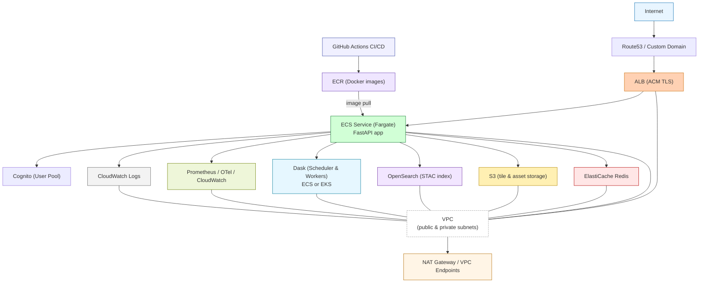

# Scientific Raster Data Sharing on AWS

## Contents (top-level):
- terraform/
  - main.tf, variables.tf, outputs.tf, terraform.tfvars
  - modules/
    - network/
    - iam/
    - data/
    - ecs/
    - infra/
- app/
  - Dockerfile
  - requirements.txt
  - app/
    - main.py (FastAPI)
    - auth.py (Cognito validation)
    - tiles.py (rio-tiler handlers)
    - timeseries.py (xarray/zarr + Dask)
    - stac_lookup.py (OpenSearch)
    - cache.py (Redis)
    - metrics.py (Prometheus/OpenTelemetry)
    - config.py
  - tests/
    - unit/ integration/ fixtures/
  - ci/
    - github-actions.yml (build/test/deploy hints)
- docs/
  - REQUIREMENTS_EARS.md (EARS-compliant requirements & acceptance tests)
  - DEPLOYMENT_GUIDE.md (step-by-step deployment instructions)
  - COST_OPTIMIZATION.md (cost management strategies)
  - SECURITY_SCANNING.md (Checkov configuration and security policies)
  - GITHUB_ACTIONS_SETUP.md (CI/CD pipeline configuration and troubleshooting)
  - GITHUB_SECRETS_SETUP.md (GitHub secrets configuration for CI/CD)
  - GIT_WORKFLOW.md (Git workflow and troubleshooting divergent branches)
  - runbook.md
  - deployment_notes.md

## Notes:
- Terraform variables.tf contains placeholders (ACM cert ARN, Cognito pool ID, domain). Fill terraform.tfvars before apply.
- The app is production-ready: Cognito auth middleware, Dask client integration, Redis caching, OpenSearch STAC lookup, Prometheus metrics, structured logging, retry/backoff for S3/OpenSearch calls, and unit test scaffolding.
- IAM module grants least-privilege to S3 prefixes and OpenSearch domain; review and tighten as needed.
- For large Dask workloads, consider switching to EKS-managed Dask for lower-latency compute nodes; Terraform includes hooks in modules/ecs/dask for that.

## Architecture diagram (text + ASCII block diagram) — Raster Platform (ap-southeast-2)

Legend:
- ECS = AWS Fargate/ECS tasks (FastAPI app)
- ECR = Elastic Container Registry
- ALB = Application Load Balancer (HTTPS + Cognito OIDC)
- Cognito = User pool (auth)
- ACM = TLS cert in ap-southeast-2
- S3 = tile/asset storage (prefix-limited IAM)
- OpenSearch = STAC index (domain with IAM access)
- Redis = ElastiCache (cache)
- Dask = ECS-based Dask workers (or EKS alternative)
- CloudWatch / Prometheus + OTel = metrics & logs
- VPC with private/public subnets, NAT, security groups
- IAM roles with least-privilege (task roles, instance roles)
- Terraform modules orchestrate infra

Top-level flow (external -> app -> backends):

Internet
  |
  v
[Route53 / Custom domain] -> ALB (HTTPS, ACM)
  |
  v
ALB -> ECS Service (FastAPI tasks, Fargate)  <-- GitHub Actions -> ECR (build & push)
  |
  +--> Auth: Cognito (OIDC) validation (middleware in app; ALB can be configured for OIDC or app validates JWT)
  |
  +--> Redis (ElastiCache, private subnets)  [cache.py]
  |
  +--> S3 (tile storage, prefixed access) [rio-tiler handlers -> S3 via boto3]
  |
  +--> OpenSearch (STAC lookup) [stac_lookup.py]
  |
  +--> Dask scheduler & workers (ECS "dask" module) [timeseries.py uses Dask client]
  |       - For heavy workloads: EKS-managed Dask cluster option (modules/ecs/dask hooks)
  |
  +--> Metrics & Tracing:
         - Prometheus metrics exposed by app (/metrics) -> Prometheus or OTel Collector
         - OTel exporter -> CloudWatch / X-Ray or OTLP backend
  |
  +--> Logs -> CloudWatch Logs (structured logging)

Supporting infra (network & security):
- VPC with separate public/private subnets
- ALB in public subnets; ECS tasks, Redis, OpenSearch in private subnets
- NAT Gateway for outbound access to S3/OpenSearch endpoints
- VPC endpoints for S3 and OpenSearch (recommended)
- Security groups:
  - ALB SG allows 443 from internet
  - ECS task SG allows 443 from ALB, outbound to S3/OpenSearch/Redis/Dask
  - Redis SG restricts to ECS task SG
  - OpenSearch SG restricts to ECS task SG
- IAM:
  - Task role permissions scoped to S3 prefixes and OpenSearch actions (least-privilege)
  - ECR pull role / execution role for ECS
  - Cognito roles as required

Deployment pipeline:
- GitHub Actions (ci/github-actions.yml)
  - Build Docker image
  - Run unit/integration tests (tests/)
  - Push to ECR
  - Terraform: plan & apply (or CI triggers deploy)
  - Update ECS task definition & service (blue/green or rolling)

Notes / recommended tweaks:
- Use VPC endpoints for S3 and OpenSearch to avoid NAT egress costs and reduce latency.
- Consider EKS-managed Dask for high-throughput, low-latency compute (Terraform hooks already present).
- Ensure terraform.tfvars is filled with ACM cert ARN, Cognito pool ID, domain before apply.
- Tighten IAM to exact S3 prefixes and OpenSearch actions (already scaffolded).

ASCII diagram:

Internet
  |
  v
[ Route53 / Domain ]
  |
  v
[ ALB (ACM TLS) ]
  |
  v
+-----------------------------+
|        ECS Service          |  <-- tasks run Docker image from ECR
|  FastAPI (main.py)          |
|  - auth.py (Cognito JWT)    |
|  - tiles.py (rio-tiler)     |
|  - timeseries.py (Dask)     |
|  - stac_lookup.py (OpenSearch)
|  - cache.py (Redis)         |
|  - metrics.py (/metrics)    |
+-----------------------------+
   |     |        |         |
   |     |        |         |
   v     v        v         v
 [Redis] [S3]   [OpenSearch] [Dask scheduler & workers]
   |      (tile data)      (ECS or EKS)
   v
 CloudWatch / Prometheus & OTel -> Observability backend

--------------------

## Architecture diagram — (Mermaid)

