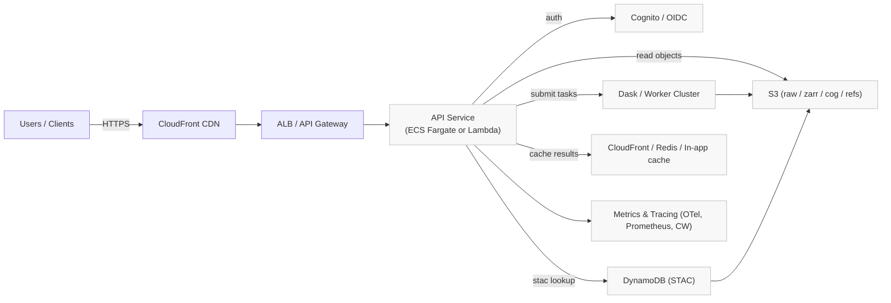
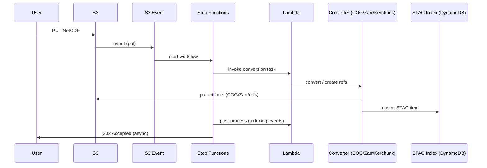

# Architecture Overview

**Purpose:** Provide a high-level, interface-first overview of the system, data flows, failure modes, and open questions to guide architecture decisions.

**Scope:** Ingress (uploads/ingestion), API surface (tiles & timeseries), storage and catalog, compute, caching, and deployment boundaries. This document omits low-level implementation details.

**Diagrams:**

**High-Level Components**
- **Ingress:** S3 raw uploads, S3 event notifications, ingestion orchestrator (Lambda / Step Functions).
- **Ingestion Compute:** Lambda or batch workers to convert NetCDF → Zarr / COG or produce Kerchunk refs.
- **Catalog:** DynamoDB STAC table (primary index) + optional GSIs for spatial/temporal lookup.
- **Storage:** S3 buckets/prefixes for raw, zarr, cog, stac/refs.
- **API Surface:** HTTP endpoints (ALB/ECS or API Gateway/Lambda) exposing tile and timeseries contracts.
- **Compute for Queries:** ECS Fargate (FastAPI) + optional Dask cluster for heavy aggregation, or Lambda for serverless queries.
- **Caching & CDN:** CloudFront for tile caching; Redis (ElastiCache) or in‑app cache for API results.
- **Observability:** Metrics (/metrics), traces (OTel), and logs (CloudWatch / Prometheus).

**Public Interfaces (contracts)**
- **Tile endpoint:** GET /tiles/{z}/{x}/{y} → 200 OK image/tile, 404 if no coverage, Cache-Control headers for CDN.
- **Timeseries endpoint:** GET /timeseries?bbox=&start=&end= → 200 OK JSON array / 204 No Content / 400 Bad Request.
- **STAC lookup:** DynamoDB query by bounding box / time range → deterministic results or empty set.
- **Ingestion webhook/event:** S3 PUT event → ingestion orchestration returns 202 Accepted and emits STAC upsert events.

**Key Data Flows**
- Upload flow: user uploads NetCDF → S3 raw → S3 event → ingestion orchestrator → conversion (COG/Zarr or Kerchunk) → STAC item upsert → Catalog index (DynamoDB) → optional indexer events to downstream consumers.
- Query flow: client → CDN/ALB → API service → STAC lookup (DynamoDB) → read assets from S3 (COG/Zarr) → compute/serve results → cache + respond.

**Failure Modes & Boundary Errors**
- **S3 read/write errors:** 5xx from S3; retry with exponential backoff; surface 503 to client if retries exhausted.
- **Catalog missing items:** 404/204 to client; ingestion should emit compensating events if STAC upsert fails.
- **Indexing lag:** eventual consistency for STAC writes — document expected propagation window (TBD).
- **Compute task failures:** Dask task failures -> retry policies; if persistent, return 500 with `Retry-After` header.
- **Auth failures:** 401 for invalid/missing token, 403 for insufficient scope.

**SLIs / SLOs (suggested)**
- **Availability:** 99.9% for tile API (SLA depends on infra choices).
- **Latency:** P95 tile response < 500ms (cache hit), P95 timeseries < 2s (typical workloads).
- **Ingestion:** Median ingestion -> STAC indexed within 2 minutes; 95th percentile within 10 minutes (TBD).

**Security & Operational Boundaries**
- Auth: JWT validation via Cognito or ALB OIDC. All write operations require authenticated principals.
- IAM: Least-privilege roles for task/lambda to access specific S3 prefixes and DynamoDB tables.
- Network: Private subnets for compute and caches; VPC endpoints for S3/DynamoDB to reduce NAT egress.

**When to choose each deployment pattern**
- **Serverless-first (API Gateway + Lambda):** low operational overhead, cost-efficient for bursty/low-throughput workloads.
- **ECS + Dask (persistent):** chosen when sustained high throughput or long-running computations needed.
- **Kerchunk approach:** preferred for large datasets to avoid data duplication and speed ingestion.

**Information Requested (TBD)**
- **Target query load:** expected RPS and burst characteristics.
- **Data size distribution:** typical NetCDF file sizes and dataset counts.
- **Required ingestion SLA:** acceptable indexing delays for STAC visibility.
- **Auth model confirmation:** ALB OIDC vs in-app Cognito JWT validation preference.

---
<small>Generated with GitHub Copilot as directed by Tilmann</small>
